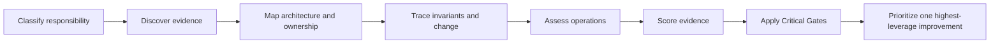

<div align="center">

# Software Engineering Health Audit

### Evidence-based engineering health, Vibe Slop risk, and production readiness

**Can a capable newcomer understand, change, verify, release, and recover this project without its chat history?**

[](https://github.com/dulanjy/software-engineering-health-audit/actions/workflows/ci.yml)
[](https://github.com/dulanjy/software-engineering-health-audit/releases)
[](https://agentskills.io)
[](LICENSE)
[](https://skills.sh/dulanjy/software-engineering-health-audit)

[中文说明](README.zh-CN.md) · [Sample audit](examples/audit-report.sample.md) · [Method](references/scoring-model.md) · [Changelog](CHANGELOG.md)

</div>

---

This Agent Skill audits whether a repository's engineering controls match its real lifecycle, complexity, and risk. It does not reward fashionable architecture, count tests as quality, or treat every prototype like a production payment system.

It keeps four conclusions separate:

| Conclusion | What it answers |
|---|---|
| **Engineering Health** | How mature are the project's engineering capabilities? |
| **Vibe Slop Risk** | How large is the gap between actual responsibility and governance? |
| **Evidence Confidence** | How much reliable evidence supports the audit? |
| **Production Readiness** | Is the current release responsibility `NOT_ASSESSED`, `BLOCKED`, `CONDITIONAL`, or `READY`? |

Critical security, data, verification, and recovery gates can override a high average score.

## 30-second start

Install with the open Agent Skills CLI:

```bash
npx skills add dulanjy/software-engineering-health-audit \
  --skill software-engineering-health-audit -g -a codex -y
```

Then ask your agent:

```text
Use $software-engineering-health-audit to perform a read-only audit of this repository.
Write audit-report.md and audit-result.json, and do not modify project source files.
```

Clone installation is also supported:

```bash
git clone https://github.com/dulanjy/software-engineering-health-audit.git \
  ~/.codex/skills/software-engineering-health-audit
```

<details>
<summary>Windows PowerShell clone command</summary>

```powershell
git clone https://github.com/dulanjy/software-engineering-health-audit.git `
  "$env:USERPROFILE\.codex\skills\software-engineering-health-audit"
```

</details>

Restart or refresh skill discovery after a clone-based installation.

## What it catches—and what it refuses to guess

| Weak audit shortcut | This Skill's behavior |
|---|---|
| “There are few tests, so the project is bad.” | Maps critical business invariants to executable evidence. |
| “The README says it is safe.” | Distinguishes documentation from code and automated enforcement. |
| “No deployment files were found, so recovery is absent.” | Marks inaccessible operational evidence as `UNKNOWN`. |
| “The total score is high, so release is safe.” | Applies Critical Gates after scoring. |
| “A large `utils` folder proves bad architecture.” | Requires evidence of mixed responsibility or harmful coupling. |
| “An experiment lacks production controls.” | Classifies project type, stage, and criticality before scoring. |

## Audit flow



Two practical tests anchor the result:

1. **Repository Amnesia Test** — could a capable newcomer take over using retained project evidence alone?
2. **Controlled Change Test** — can one ordinary change be traced to predictable owners, boundaries, verification, and recovery?

The default deliverables are a human-readable `audit-report.md` and a machine-readable `audit-result.json`. See the [fictional sample report](examples/audit-report.sample.md) and its [matching JSON](examples/audit-result.sample.json).

## Read-only safety boundary

The default mode is `AUDIT_ONLY`.

- Reads repository files, local Git history, CI, configuration, tests, and documentation.
- Does not refactor, fix findings, install project dependencies, alter databases or infrastructure, commit, or release.
- Does not test discovered credentials or exploit suspected authorization weaknesses.
- Redacts secret values and reports only the minimum evidence needed to locate the exposure.
- Treats unavailable evidence as `UNKNOWN`, never as a confirmed failure.

Remediation should be a separately authorized task.

## Optional helpers

Both helpers use only the Python standard library, do not import repository code, and emit JSON to stdout by default.

```bash
# Path and file-metadata inventory; no file contents are read
python scripts/repository_inventory.py /path/to/repository

# Git hotspots and co-change candidates; no commit messages or contents are read
python scripts/git_change_coupling.py /path/to/repository --max-commits 300
```

Their output selects inspection targets; it does not create automatic findings.

## Repository map

```text
SKILL.md                         Agent entrypoint and audit boundary
agents/openai.yaml              Codex-facing discovery metadata
references/                     Classification, evidence, scoring, gates, schema
assets/                         Report template and JSON Schema
scripts/                        Optional read-only discovery helpers
examples/                       Fictional report and machine-readable result
tests/                          Helper and package-contract tests
test-prompts.json               Behavioral evaluation cases
```

## Verification

```bash
python -m pip install -r requirements-dev.txt
python -m unittest discover -s tests -v
python scripts/repository_inventory.py .
```

CI runs the package tests on Linux and Windows with Python 3.10 and 3.12. The repository is also discoverable as one skill through `npx skills add ... --list`.

## Method status

Version `0.2` is an evidence-grounded audit framework, not a universal static analyzer or a certified production-readiness standard. The initial weights and thresholds are explicit so teams can review them, but they still require calibration across varied real repositories and independent reviewers before organization-wide benchmarking.

Generic cross-language dependency analysis is intentionally not bundled. Prefer project-native analyzers when they already exist and are safe to run.

## Contributing

Reports of false positives, missing evidence handling, and inconsistent scoring are especially valuable. See [CONTRIBUTING.md](CONTRIBUTING.md) and use the audit-quality issue template.

## License

[MIT](LICENSE)
